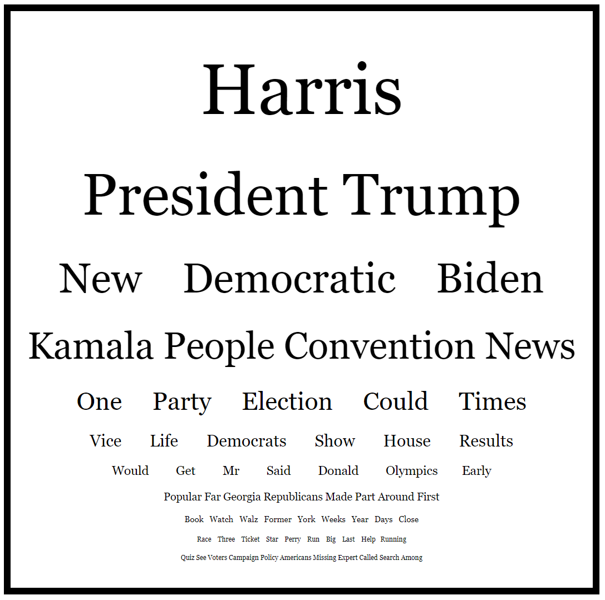

# From Words to Trends: Capturing the Pulse of Today’s News

## [Live Visualization](https://nyt-headline-trends-7042762eac8e.herokuapp.com/)

### Project Overview
This project visualizes the most common words from recent New York Times articles over different time periods (1 day, 7 days, 30 days). The resulting word cloud arranges words in descending order of frequency, with the most frequently mentioned words appearing larger and at the top, and the least frequent words appearing smaller at the bottom. The project leverages Natural Language Processing (NLP) techniques, data pipelines, and Flask web development to offer real-time insights into the topics dominating our collective conversations.

The application is deployed on Heroku, allowing you to view the live visualization in real-time as it fetches the latest data from the New York Times API.

## Table of Contents
- [Live Visualization](#live-visualization)
- [Project Overview](#project-overview)
- [Installation](#installation)
  - [Prerequisites](#prerequisites)
  - [Running the Project](#running-the-project)
- [Project Motivation](#project-motivation)
- [File Descriptions](#file-descriptions)
- [How the Project Works](#how-the-project-works)
  - [Key Features](#key-features)
- [Results and Insights](#results-and-insights)
- [ETL Pipeline Details](#etl-pipeline-details)
- [Heroku Deployment](#heroku-deployment)
- [Licensing, Authors, and Acknowledgements](#licensing-authors-and-acknowledgements)

## Installation

### Prerequisites
This project was developed using Python 3.8. The following libraries are required but may not be included in the Anaconda distribution:

```bash
pip install -r requirements.txt
```
#### Key Libraries:

* `Flask` (1.1.2) - For building and serving the web application.
* `Redis Queue (RQ)` - For managing background tasks.
* `requests` - For interacting with the New York Times API.
* `spaCy` - For advanced NLP processing.
* `NLTK` - For stopword removal.
* `dotenv` - For managing environment variables.

You'll need `.env` file containing:
```plaintext
API_KEY=<your_nyt_api_key>
REDIS_URL=redis://<your_redis_url>
```
## Running the Project
1. Clone the repository:
    ```bash
   git clone https://github.com/yourusername/nyt-headline-trends.git
   cd nyt-headline-trends
   ```
2. Start the Flask app:
    ```bash
   python app.py
   ```
3. Start the Flask app:
    ```bash
   python worker.py
   ```
Access the app at `http://127.0.0.1:5000/`.

## Project Motivation
In an era of information overload, it’s easy to lose sight of the bigger picture when it comes to news and public discourse. The motivation behind this project was to explore how key topics in the news evolve over time and to visualize these trends in an accessible, engaging way. By capturing real-time data from the New York Times, the project offers a clear view of what society is currently focused on, highlighting not just the stories themselves but the underlying trends that drive them.

This project also showcases my ability to build a complete data pipeline, from data ingestion and processing to real-time web deployment, leveraging both NLP techniques and web development.

## File Descriptions
* `app.py`: The main Flask application that handles routing, enqueues tasks, and renders the processed results in a web interface.
* `formatted_lines.py`: Contains the core NLP logic for fetching and processing articles, including word frequency analysis and text formatting.
* `worker.py`: Manages the Redis worker for background task processing, ensuring tasks run efficiently across different systems.
* `tasks.py`: Handles the queued task that fetches, processes, and formats the data for display.
* `templates/index.html`: The HTML template for displaying the visualized word cloud.

## How the Project Works

This project functions as an ETL (Extract, Transform, Load) pipeline that automates the process of ingesting, processing, and visualizing data:

* **Extract:** The pipeline continuously pulls data from the New York Times API, fetching the most popular articles from multiple time periods (1 day, 7 days, 30 days).
* **Transform:** The extracted data undergoes several transformations, including text processing (tokenization, stopword removal), word frequency analysis, and custom formatting.
* **Load:** The processed data is loaded into a dynamic visualization displayed through a Flask web interface. The visualization updates each time the app is accessed, ensuring real-time insights.

### Key Features:
* **Concurrency and Task Management:** Uses ThreadPoolExecutor for concurrent data fetching and Redis Queue (RQ) for background task management, ensuring smooth real-time updates.
* **NLP Techniques:** Includes tokenization, stopword removal, and word frequency analysis using spaCy and NLTK.
* **Dynamic Visualization:** Words are arranged in descending order by frequency, with dynamic font sizing to reflect their prominence.

## Results and Insights

The word cloud generated by the project effectively captures current events, with names like "Harris," "Trump," and "Biden" standing out. This kind of visualization offers a snapshot of the cultural and political topics driving today’s news cycle, making it a valuable tool for understanding public discourse.

From a broader perspective, this visualization acts as a cultural time capsule, reflecting what society cares about in a particular moment. The larger the word, the more prominent it is in our collective conversation, offering an insightful look into the trends that define our times.

## ETL Pipeline Details
This project highlights a robust data pipeline built to handle the entire workflow, from data extraction to real-time visualization. The ETL process is orchestrated using Redis Queue (RQ) for asynchronous task management, ensuring the app remains scalable and efficient. The pipeline’s design allows it to update automatically, pulling fresh data and reflecting the latest trends each time the app is accessed.

## Heroku Deployment
The application is live and deployed on Heroku. You can access it [here](https://nyt-headline-trends-7042762eac8e.herokuapp.com/).

The deployment on Heroku allows the application to dynamically fetch the latest data from the New York Times API each time the page is loaded, ensuring that the visualization is always up-to-date.

To deploy the app on Heroku yourself:

1. Install the Heroku CLI: [Heroku CLI](https://devcenter.heroku.com/articles/heroku-cli)
    ```bash
    heroku login
    ```

2. Log in to Heroku:
    ```bash
    heroku create <your-app-name>
    ```
3. Create a new Heroku app:
    ```bash
    heroku login
    ```
4. Deploy the app:
    ```bash
    git push heroku main
    ```
5. Set your environment variables:
    ```bash
    heroku config:set API_KEY=<your_nyt_api_key> REDIS_URL=<your_redis_url>
    ```
## Licensing, Authors, and Acknowledgements
This project is licensed under the MIT License.

**Authors:** Tully O'Leary tullyro@gmail.com

**Acknowledgements:**

* Data provided by The New York Times.
* Special thanks to Flask, Redis, and the NLP community for their resources and documentation.